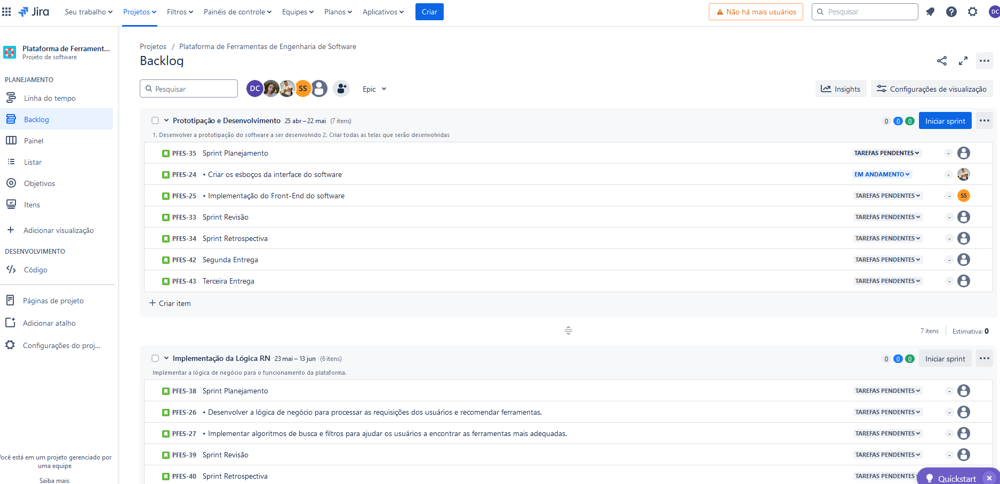
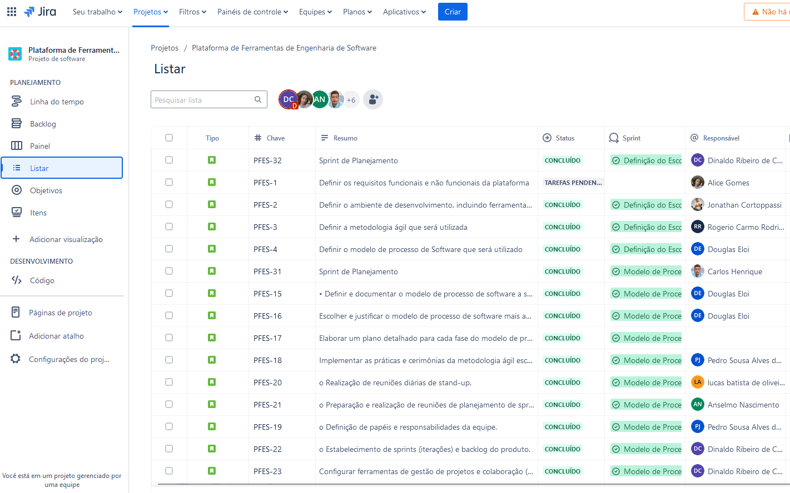

# Ferramentas de Gestão: JIRA

## Gestão Eficiente de Projetos Ágeis:
        
**Scrum e Kanban:** Jira oferece suporte nativo para metodologias ágeis como Scrum e Kanban, que se alinham perfeitamente com nosso modelo de desenvolvimento incremental e o uso da metodologia Scrum. Ele permite a criação e gerenciamento de sprints, backlogs, e boards visuais que facilitam o acompanhamento do progresso das tarefas.

**Flexibilidade:** Permite customizar os fluxos de trabalho para atender às necessidades específicas do nosso projeto, proporcionando flexibilidade para ajustar processos à medida que o projeto evolui.

## Transparência e Visibilidade:

**Dashboard Personalizáveis:** Jira permite a criação de dashboards personalizáveis onde todas as partes interessadas podem visualizar o progresso do projeto, status das tarefas, impedimentos, e outras métricas importantes em tempo real.

**Relatórios e Análises:** Oferece uma ampla gama de relatórios e ferramentas de análise, como gráficos de burndown, relatórios de sprint e relatórios de velocidade, que ajudam a equipe a monitorar o desempenho e identificar áreas para melhoria.

## Colaboração e Comunicação:
        
**Centralização das Informações:** Todas as informações relacionadas ao projeto, como requisitos, tarefas, bugs, e documentação, são centralizadas em um único lugar. Isso facilita a colaboração entre os membros da equipe e garante que todos estejam alinhados.

**Integrações:** Jira se integra facilmente com outras ferramentas de colaboração e desenvolvimento, como Confluence, Bitbucket, GitHub, e Slack, permitindo uma comunicação e fluxo de trabalho mais integrados e eficientes.

## Gestão de Tarefas e Requisitos:

        
**Backlog do Produto:** Jira permite a criação e gerenciamento eficaz do backlog do produto, onde podemos priorizar requisitos e tarefas com base no valor de negócio e feedback dos stakeholders.
        
**Histórias de Usuário e Tarefas:** Facilita a criação de histórias de usuário, tarefas e sub-tarefas detalhadas, ajudando a equipe a entender claramente o trabalho a ser feito e a dividi-lo em partes manejáveis.

## Rastreamento de Problemas e Bugs:
        
**Registro e Monitoramento:** Jira oferece funcionalidades robustas para registrar, rastrear e gerenciar problemas e bugs, garantindo que todas as questões sejam resolvidas de maneira oportuna e eficiente.
        
**Priorização e Resolução:** Permite priorizar problemas com base na severidade e impacto, facilitando a resolução rápida dos problemas críticos.

## Automatização de Processos:
        
**Automatizações Personalizáveis:** Jira permite configurar automatizações para tarefas repetitivas, como transições de status, notificações e atualizações, economizando tempo e reduzindo a carga de trabalho manual.
        
**Regras de Workflow:** Podemos definir regras de workflow personalizadas que ajudam a garantir que todos os processos sigam as etapas e aprovações necessárias.

## Segurança e Permissões:
        
**Controle de Acesso:** Jira oferece controles de segurança robustos que permitem definir permissões detalhadas para diferentes usuários e grupos, garantindo que apenas pessoas autorizadas tenham acesso a informações sensíveis.
        
**Conformidade:** Ajuda a manter a conformidade com as políticas de segurança e regulamentos da organização, protegendo os dados do projeto.
